<!-- ══════════ HERO BANNER ══════════ -->

 

<!-- ══════════ 项目卡片 ══════════ -->
<table>
<tr>
<td width="50%" valign="top">

</td>
<td width="50%" valign="top">

</td>
</tr>
</table>

<!-- ══════════ 赛博朋克贪吃蛇 ══════════ -->
<picture>
  <source media="(prefers-color-scheme: dark)" srcset="https://raw.githubusercontent.com/2019-02-18/2019-02-18/output/github-snake-dark.svg" />
  <source media="(prefers-color-scheme: light)" srcset="https://raw.githubusercontent.com/2019-02-18/2019-02-18/output/github-snake.svg" />
  
</picture>

<!-- ══════════ 技术栈 + 访客 ══════════ -->

