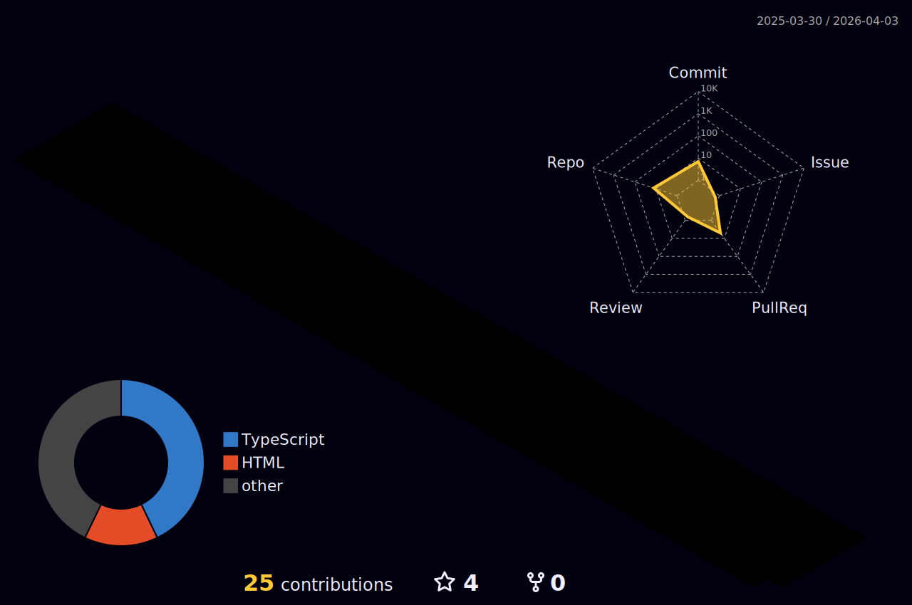

<!-- 动态打字效果 -->

<!-- 胶囊徽章 -->

<!-- 技术栈图标 -->

<!-- GitHub Stats 并排 -->

<!-- GitHub Streak -->

<!-- 贪吃蛇动画（需配置 GitHub Action） -->
<picture>
  <source media="(prefers-color-scheme: dark)" srcset="https://raw.githubusercontent.com/2019-02-18/2019-02-18/output/github-snake-dark.svg" />
  <source media="(prefers-color-scheme: light)" srcset="https://raw.githubusercontent.com/2019-02-18/2019-02-18/output/github-snake.svg" />
  
</picture>

<!-- 3D 贡献图（需配置 GitHub Action） -->

<!-- 项目卡片 -->

<!-- 访客计数 -->

<!-- 底部波浪 -->

